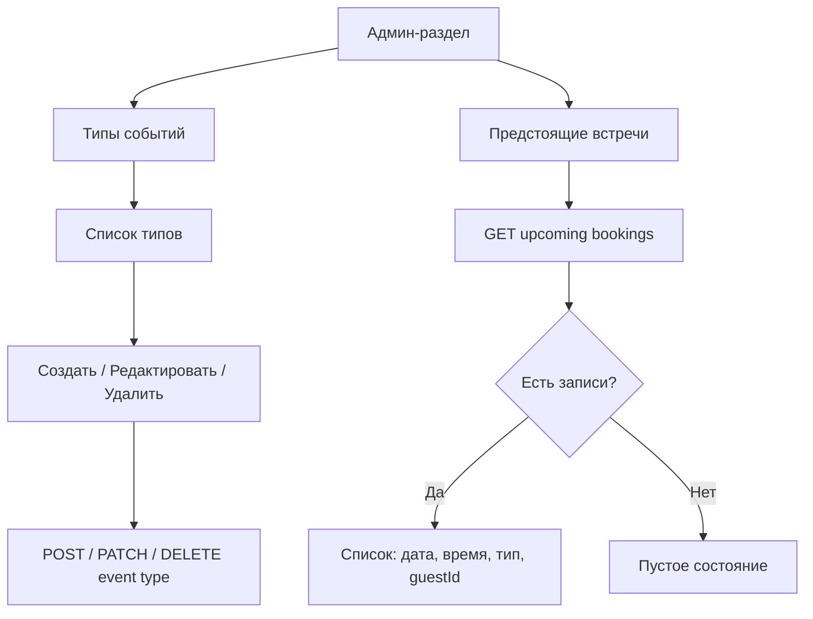
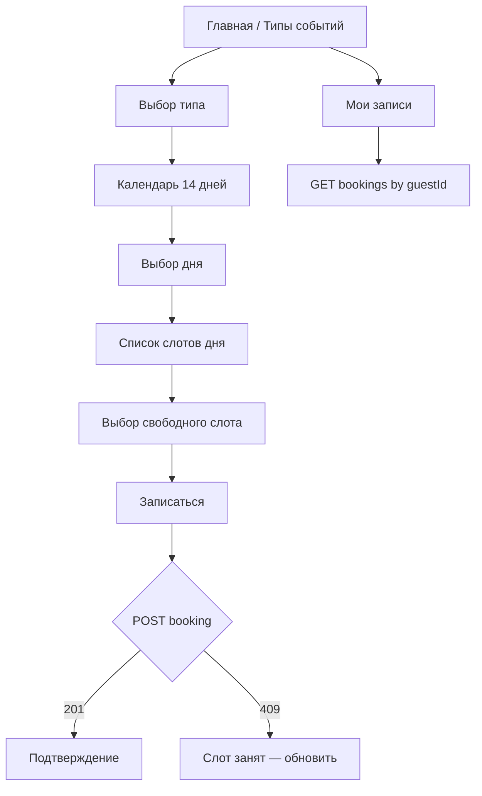
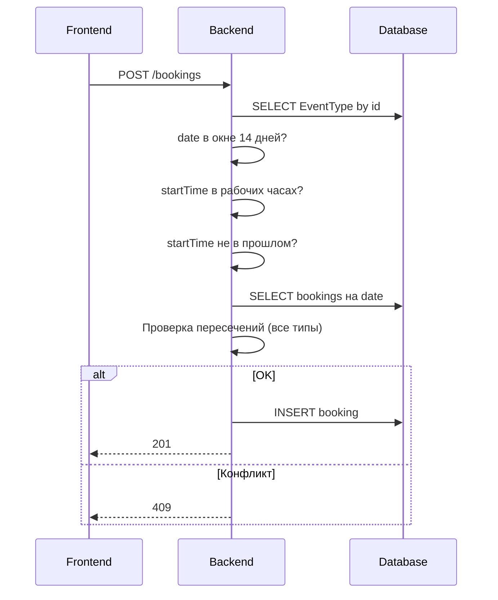

# Функциональные требования: «Запись на звонок»

Документ основан на [project-description.md](./project-description.md) и дополнительном описании ролей и календаря. Требования проработаны в две итерации: первая фиксирует базовый объём, вторая уточняет флоу, граничные случаи и бизнес-логику.

---

## Итерация 1 — базовый объём

### 1. Назначение системы

Сервис упрощённого бронирования звонков по мотивам Cal.com. Владелец календаря настраивает **типы событий**, гость выбирает тип, свободный слот в ближайшие 14 дней и оформляет запись. Без регистрации, авторизации и интеграций с внешними календарями.

### 2. Роли

| Роль | Описание |
|------|----------|
| **Владелец календаря** | Один заранее заданный профиль. Используется в админской части по умолчанию. Аутентификации нет — доступ к админ-разделу открыт. |
| **Гость** | Пользователь без аккаунта. Бронирует слоты анонимно. Идентифицируется `guestId` (UUID v4) в `localStorage` браузера. |

### 3. Сущности

#### 3.1. Тип события (`EventType`)

Создаётся владельцем. Определяет формат встречи для гостя.

| Поле | Описание |
|------|----------|
| `id` | Уникальный идентификатор (задаёт владелец). |
| `name` | Название. |
| `description` | Описание. |
| `durationMinutes` | Длительность в минутах. |

#### 3.2. Бронирование (`Booking`)

| Поле | Описание |
|------|----------|
| `id` | Серверный идентификатор. |
| `guestId` | UUID гостя из `localStorage`. |
| `eventTypeId` | Ссылка на тип события. |
| `date` | Дата встречи. |
| `startTime` | Время начала. |
| `durationMinutes` | Копия из типа события на момент бронирования. |

### 4. Функциональные блоки

#### 4.1. Админская часть (владелец)

- **CRUD типов событий:**
  - **Создание** — форма с полями `id`, `name`, `description`, `durationMinutes`.
  - **Просмотр** — список всех типов в админке.
  - **Редактирование** — изменение `name`, `description`, `durationMinutes` (поле `id` неизменяемо).
  - **Удаление** — удаление типа, если нет предстоящих бронирований на этот тип.
- **Просмотр предстоящих встреч** — единый список бронирований всех типов событий, только будущие записи.

#### 4.2. Гостевая часть

1. Страница с видами брони — список типов событий (название, описание, длительность).
2. Выбор типа события → календарь со слотами.
3. Выбор свободного слота в окне **14 дней** от текущей даты.
4. Подтверждение → создание бронирования.
5. **Мои записи** — просмотр предстоящих бронирований текущего `guestId`.

#### 4.3. Генерация слотов

- Рабочий день: **09:00–19:00** (окончание не позже 19:00).
- Сетка строится по `durationMinutes` выбранного типа события: стартовые времена с шагом, равным длительности типа.
- Слоты виртуальные; в БД хранятся только бронирования.

#### 4.4. Окно записи

- Доступные для бронирования даты: **сегодня … сегодня + 13 дней** (всего 14 календарных дней).
- Даты вне окна не отображаются как доступные / не принимаются API.

#### 4.5. Правило занятости

На одно и то же время **нельзя** создать две записи, **даже если это разные типы событий**. Конфликт определяется пересечением временных интервалов на одну дату.

#### 4.6. Идентификация гостя

- При первом визите фронтенд генерирует UUID v4, сохраняет в `localStorage`.
- `guestId` передаётся при создании бронирования и при запросе «Моих записей».

### 5. Ограничения (out of scope)

- Регистрация, логин, OAuth.
- Несколько владельцев / переключение профилей владельца.
- Синхронизация с внешними календарями.
- Уведомления (email, push, SMS).
- Отмена / перенос бронирования гостем.
- Изменение `id` типа события после создания.
- Настройка рабочих часов через UI.

### 6. Нефункциональные ориентиры

- Законченное MVP: владелец создаёт типы и видит встречи; гость выбирает тип и бронирует слот.
- Источник истины по занятости — сервер / БД.

---

## Итерация 2 — детализация флоу и логики

### 7. Модель данных (логическая)

#### 7.1. Тип события

```typescript
EventType {
  id: string          // уникальный, задаёт владелец (например "intro-call")
  name: string
  description: string
  durationMinutes: int  // > 0, укладывается в рабочий день
  createdAt: datetime
}
```

**Ограничения на `durationMinutes`:**

- Значение > 0.
- Минимум один слот в рабочем дне: `durationMinutes ≤ 600` (10 часов).
- Последний старт: `09:00 + n * durationMinutes`, где `start + duration ≤ 19:00`.

#### 7.2. Бронирование

```typescript
Booking {
  id: uuid
  guestId: uuid
  eventTypeId: string
  eventTypeName: string     // денормализация для списков (опционально)
  date: date
  startTime: time           // HH:mm
  durationMinutes: int
  endTime: time             // вычисляемое
  createdAt: datetime
}
```

#### 7.3. Слот (виртуальная сущность)

Интервал `[startTime, endTime)` на конкретную дату для выбранного `EventType`. Статус:

- `available` — нет пересечений с бронированиями;
- `booked` — есть пересечение;
- `past` — начало уже прошло (для сегодня);
- `out_of_window` — дата вне 14-дневного окна (не показывается гостю).

### 8. Правила конфликтов

**Принцип:** конфликт зависит только от даты и временного интервала. `eventTypeId` **не влияет** на проверку.

| Существующая запись | Новая запись | Результат |
|---------------------|--------------|-----------|
| 10:00–10:30, тип A | 10:00–10:15, тип B | **Отклонено** |
| 10:00–10:15, тип A | 10:15–10:30, тип B | **Разрешено** (смежные интервалы) |
| 10:00–10:45, тип A | 10:30–11:00, тип B | **Отклонено** |

Условие пересечения (полуоткрытые интервалы):

```
A.start < B.end AND B.start < A.end
```

### 9. Окно записи (14 дней)

```
windowStart = today
windowEnd   = today + 13 days  // включительно
```

| Дата | Поведение |
|------|-----------|
| < `windowStart` | Недоступна (прошлое) |
| `windowStart` … `windowEnd` | Доступна, если есть свободные слоты |
| > `windowEnd` | Недоступна, вне окна |

Календарь гостя показывает только дни внутри окна. Если окно пересекает границу месяца — отображаются дни из двух месяцев без навигации за пределы 14 дней.

### 10. Детальный флоу владельца



#### 10.1. Создание типа события

**Вход:** `id`, `name`, `description`, `durationMinutes`.

**Валидация:**

| Правило | Ошибка |
|---------|--------|
| `id` не пустой, уникальный | 400 / 409 |
| `name` не пустой | 400 |
| `description` — строка (может быть пустой) | 400 |
| `durationMinutes` > 0, хотя бы один слот в 09:00–19:00 | 400 |

**Результат:** тип появляется на гостевой странице выбора.

#### 10.2. Редактирование типа события

**Вход:** `eventTypeId` (из URL), `name`, `description`, `durationMinutes`.

**Правила:**

- `id` типа **не изменяется** после создания.
- Обновляются только `name`, `description`, `durationMinutes`.
- Изменение `durationMinutes` влияет на сетку слотов для **новых** бронирований.
- Уже созданные бронирования сохраняют `durationMinutes` и `eventTypeName` на момент записи.

**Валидация:** те же правила, что при создании, кроме уникальности `id`.

**Результат:** гостевая карточка и календарь отражают обновлённые данные.

#### 10.3. Удаление типа события

**Вход:** `eventTypeId`.

**Правила:**

- Удаление разрешено, если **нет предстоящих** бронирований с этим `eventTypeId`.
- При наличии предстоящих бронирований — отклонение с кодом **409**.
- Прошедшие бронирования не блокируют удаление (они хранят `eventTypeName` денормализованно).

**Результат:** тип исчезает из гостевого каталога; новые бронирования на этот тип невозможны.

#### 10.4. Предстоящие встречи

**Содержимое строки (минимум):**

- Дата и время (начало – окончание).
- Название типа события.
- `guestId` (или усечённый).
- Длительность.

**Фильтр:** только записи с `start > now`.  
**Сортировка:** `date`, `startTime` (возрастание).  
**Охват:** все типы событий в одном списке.

### 11. Детальный флоу гостя



#### 11.1. Инициализация гостя

- Проверить `localStorage.guestId`; при отсутствии — сгенерировать UUID v4.
- UUID постоянен в рамках браузера.

#### 11.2. Страница типов событий

- `GET /event-types` — список карточек.
- На карточке: `name`, `description`, `durationMinutes`.
- Клик по карточке → флоу бронирования для выбранного `eventTypeId`.

**Пустое состояние:** «Нет доступных типов событий» (владелец ещё не создал типы).

#### 11.3. Календарь

**Вход:** `eventTypeId`.

**Отображение:**

- Дни в диапазоне `[today, today+13]`.
- Для каждого дня — бейдж `freeSlotCount` (свободные слоты данного типа).
- День без свободных слотов — кликабелен, но бронирование невозможно.
- Прошедшие слоты сегодняшнего дня не учитываются в `freeSlotCount`.

**Расчёт `freeSlotCount`:**

1. Сгенерировать слоты дня для `eventType.durationMinutes`.
2. Исключить `past`-слоты (для сегодня).
3. Исключить слоты с пересечением **любых** бронирований на эту дату.
4. Посчитать оставшиеся.

#### 11.4. Список слотов дня

**Вход:** `eventTypeId`, `date`.

- Хронологический список слотов.
- Статусы: `available`, `booked`, `past`.
- Выбор только одного `available`-слота.
- Занятый слот недоступен для выбора.

#### 11.5. Подтверждение бронирования

**Запрос:** `POST /bookings` с `guestId`, `eventTypeId`, `date`, `startTime`.

- `durationMinutes` берётся из типа события на сервере (не доверяем клиенту).
- Успех → экран подтверждения с деталями типа и времени.
- 409 → «Слот уже занят», обновить календарь и слоты.

#### 11.6. Мои записи (гость)

**Запрос:** `GET /bookings?guestId={uuid}&upcoming=true`.

**Отображение:**

- Только предстоящие бронирования текущего `guestId` (`date + startTime > now`).
- Сортировка по дате и времени (возрастание).
- На каждой строке: дата, время (начало – окончание), название типа, длительность.

**Пустое состояние:** «У вас нет предстоящих записей».

**Навигация:** ссылка «Мои записи» доступна с главной страницы и после успешного бронирования.

**Ограничение:** гость видит только записи своего браузера (`guestId` из `localStorage`); перенос между устройствами не поддерживается.

### 12. Серверная логика бронирования



**Валидация `POST /bookings`:**

| Правило | Код |
|---------|-----|
| `eventTypeId` существует | 404 |
| `date` в окне [today, today+13] | 400 |
| `date` < today | 400 |
| `startTime` + `duration` ≤ 19:00 | 400 |
| `startTime` ≥ 09:00 | 400 |
| Сегодня: `startTime` ≥ now | 400 |
| Пересечение с любым бронированием | 409 |
| `guestId` — валидный UUID | 400 |

### 13. Генерация сетки слотов

```
function generateSlots(durationMinutes):
  slots = []
  current = 09:00
  while current + durationMinutes <= 19:00:
    slots.append(current)
    current += durationMinutes
  return slots
```

Примеры:

| durationMinutes | Кол-во слотов | Последний старт |
|-----------------|---------------|-----------------|
| 15 | 40 | 18:45 |
| 30 | 21 | 18:30 |
| 45 | 13 | 18:15 |
| 60 | 10 | 18:00 |

### 14. Таймзона

- Одна фиксированная таймзона приложения (например, `Europe/Moscow`).
- `today`, окно 14 дней и «прошлое/будущее» считаются в этой таймзоне.
- API принимает `date` + `time` без offset.

### 15. Состояния UI и ошибки

| Ситуация | Поведение |
|----------|-----------|
| Нет типов событий | Гостю — пустое состояние; владельцу — подсказка создать тип |
| День вне 14-дневного окна | Не показывается в календаре гостя |
| Все слоты дня заняты | `freeSlotCount = 0`, кнопка «Записаться» неактивна |
| 409 при бронировании | Сообщение + обновление слотов |
| Дубликат `id` типа события | Ошибка при создании |
| Удаление типа с предстоящими встречами | 409, тип не удалён |
| Пустые «Мои записи» | Сообщение о пустом состоянии |

### 16. Маршрутизация (предложение)

| Путь | Назначение |
|------|------------|
| `/` | Список типов событий (гость) |
| `/book/:eventTypeId` | Календарь и слоты |
| `/my-bookings` | Предстоящие записи гостя |
| `/admin` | Админ-раздел владельца |
| `/admin/event-types` | Список типов событий |
| `/admin/event-types/new` | Создание типа события |
| `/admin/event-types/:id/edit` | Редактирование типа события |
| `/admin/bookings` | Предстоящие встречи |

### 17. Критерии приёмки (MVP)

- [ ] Владелец создаёт тип события с `id`, `name`, `description`, `durationMinutes`.
- [ ] Владелец редактирует `name`, `description`, `durationMinutes` существующего типа.
- [ ] Владелец удаляет тип без предстоящих бронирований; при наличии — отказ.
- [ ] Гость видит список типов с названием, описанием и длительностью.
- [ ] Гость выбирает тип → календарь → слот → бронирование.
- [ ] Гость видит свои предстоящие записи на странице «Мои записи».
- [ ] Бронирование возможно только в окне 14 дней от сегодня.
- [ ] Занятый слот недоступен; пересечение разных типов событий отклоняется.
- [ ] Владелец видит единый список предстоящих встреч всех типов.
- [ ] `guestId` сохраняется в `localStorage`.
- [ ] Рабочие часы 09:00–19:00 соблюдаются.
